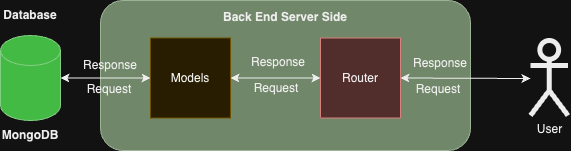

# backend-finalproject-gigih

# Final Project Generasi GIGIH (Backend)

This repository was created as proof that the Final Project Generation Gigih 3.0 Full Stack Engineering by GoTo Impact Foundation has been completed

## Front-End Final Project

If you want to see Front-End Final Project Generasi Gigih you can access :
`https://github.com/zidaneibrahimf7/frontend-finalproject-gigih`

## Database Structure


There are 3 collections in the database models:

- `videoList`
- `productList`
- `commentList`

## API Architecture



the API structure

- `User` is the user who will consume the API give some response and request
- `Backend` is the backend server that will serve the API (Node JS and Express JS) to get request from user and get response the database from mongodb. finally the backend give a response to user again
- `MongoDB` is the database that will store the data to response the request from backend

## API Request and Response

### VideosList

```json
{
  "videoID": "string",
  "title": "string",
  "thumbnailUrl": "string"
}
```

### ProductList

```json
{
  "videoID": "string",
  "productID": "string",
  "linkProduct": "string",
  "productName": "string",
  "price": "number"
}
```

### CommentList

```json
{
  "videoID": "string",
  "username": "string",
  "comment": "string",
  "timestamp": "date" , "default: Date.now()"
}
```

The `productList` and `commentList` collection have a field called `videoID` which is a reference to the `videoID` field of the `videosList` collection.

inside the `Backend Architecture` there are 2 layers:

- `routes` : layer that will handle the request from the `User` and send the response back to the `User`
- `models` : is the layer that will handle the data from the `MongoDB` and send the data back to the `routes`

## List APIs

The list of APIs is as follows:

### GET api/videos

This endpoint allows users to get thumbnail in videoList.

- URL Params:
  None
- Data Params:
  None
- Headers:
  Content-Type: application/json
- Success Response
  `CODE: 200`

  - Content:

  ```json
  [
    {
      "videoTitle": "String",
      "videoID": "String",
      "thumbnailUrl": "String"
    }
  ]
  ```

- Error Response

  `CODE: 404`

  - Content:

  ```json
  {
    "message": "Videos not found"
  }
  ```

### GET api/product/:videoID

This endpoint allows users to get product from productList with videoID required

- URL Params:
  required: `videoID=[string]`
- Data Params:
  None
- Headers:
  context-type: application/json
- Success Response :
  `Code: 200`

  - Content:

  ```json
  [
    {
      "videoID": "String",
      "productID": "String",
      "linkProduct": "String",
      "productName": "String",
      "price": Number
    }
  ]
  ```

- Error Response :
  `Code: 500`
  Content:

  ```json
  {
    "message": "Internal Server Error"
  }
  ```

  `Code: 404`
  Content:

  ```json
  {
    "message": "Video ID is not found in database"
  }
  ```

### GET api/comment/:videoID

This endpoint returns all comments of a video by its videoID

- URL Params:
  required: `videoID=[string]`
- Data Params:
  None
- Headers:
  Context-text: application/json
- Success Response
  `Code: 200`

  - Content:

  ```json
  {
    "videoID": "String",
    "username": "String",
    "comment": "String",
    "timestamp": "Date"
  }
  ```

- Error Response
  `Code: 500`

  - Content:

  ```json
  {
    "message": "Internal server error"
  }
  ```

  `Code: 404`

  - Content:

  ```json
  {
    "message": "Video ID not found in database"
  }
  ```

  ### POST api/comment/submit-comment

This endpoint returns all comments of a video by its videoID

- URL Params:
  required:
- Data Params:
  None
- Headers:
  Context-text: application/json
- Success Response
  `Code: 200`

  - Content:

  ```json
  {
    "videoID": "String",
    "username": "String",
    "comment": "String",
    "timestamp": "Date", "Default: format(Date.Now())"
  }
  ```

- Error Response
  `Code: 500`

  - Content:

  ```json
  {
    "response": "Fail",
    "message": "Internal server error"
  }
  ```

  `Code: 409`

  - Content:

  ```json
  {
    "message": "Video ID not found in database"
  }
  ```

  ### DELETE api/comment/submit-comment

This endpoint returns all comments of a video by its videoID

- URL Params:
  required:
- Data Params:
  None
- Headers:
  Context-text: application/json
- Success Response
  `Code: 200`

  - Content:

  ```json
  {
    "message": "Comment deleted successfully"
  }
  ```

- Error Response
  `Code: 404`

  - Content:

  ```json
  {
    "message": "Comment not found!"
  }
  ```

  `Code: 500`

  - Content:

  ```json
  {
    "message": "Internal server error"
  }
  ```

  `Code: 409`

  - Content:

  ```json
  {
    "message": "Video ID not found in database"
  }
  ```

## How to run!

1. Clone this repository

```bash
git clone `https://github.com/zidaneibrahimf7/backend-finalproject-gigih.git`
```

2. Install dependencies

```bash
npm install
```

3. Run the server

```bash
npm start
```

4. Build your .env and build your own PORT. So you can access the database using `http://localhost:(YourPortNumber)`
